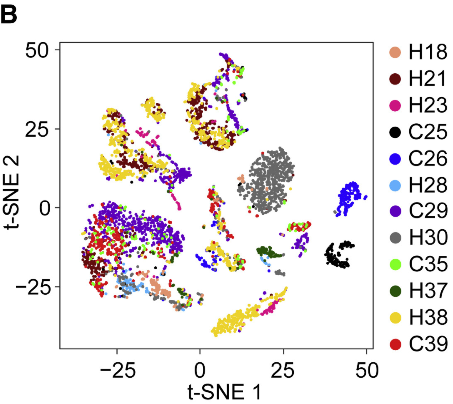
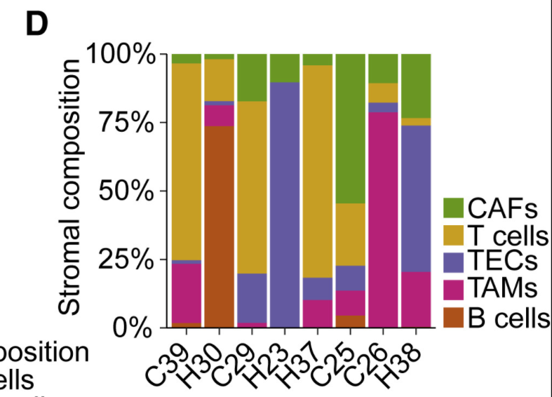

<style>
  p{
    font-size:18px;
    line-height:1.7em;
  }
</style>

```{r setup, include=FALSE}
all_times <- list()  # store the time for each chunk
knitr::knit_hooks$set(time_it = local({
  now <- NULL
  function(before, options) {
    if (before) {
      now <<- Sys.time()
    } else {
      res <- difftime(Sys.time(), now, units = "secs")
      all_times[[options$label]] <<- res
    }
  }
}))
knitr::opts_chunk$set(
  tidy = TRUE,
  tidy.opts = list(width.cutoff = 95),
  fig.width = 10,
  message = FALSE,
  warning = FALSE,
  time_it = TRUE
)
```


# 1. Data Download and Extract

Downloaded data from GEO(GSE125449) and unzip.   [GSE125449-Page](https://www.ncbi.nlm.nih.gov/geo/query/acc.cgi?acc=GSE125449)  

Set1: discovery set, 12 patients, 5115 cells after initial quality controls  
Set2: validation set, 7 patients  

Features:  
* Col1: gene.ids  
* Col2: gene.symbol
```{bash}
zcat ../data/Set1.raw/features.tsv.gz | head
```

Barcodes:  
List of barcodes
```{bash}
zcat ../data/Set1.raw/barcodes.tsv.gz | head
```

Matrix：
* Col 1: Line number of Gene ID in features.tsv   
* Col 2: Line number of cell info in barcodes.tsv     
* Col 3: Gene TPM
```{bash}
zcat  ../data/Set1.raw/matrix.mtx.gz | head
```

# 2. Examine Data and Setup Seurat Object
```{r env}
library(Seurat)
library(dplyr)
library(cowplot)
library(Cairo)
```

## 2.1 Read10X
Rename `GES125449_Set1/2_barcodes.tsv.gz` to `barcodes.tsv.gz`, `GES125449_Set1/2_genes.tsv.gz` to `features.tsv.gz`, `GES125449_Set1/2_matrix.mtx.gz` to `matrix.mtx.gz` and store in separated files named `Set1.raw` and `Set2.raw`.

```{r load set1}
# Load dataset Set1
set1 <- Read10X(data.dir = "../data/Set1.raw/")
# Check the data
set1[1:10, 1:3]
```

## 2.2 Examine Data
Here we see the upper left corner of the sparse matrix. The columns are indexed by 10x cell barcodes (each 16 nt long, e.g. AAACCTGAGGCGTACA), and the rows are the gene names.  
There are several zeroes here (indicated by the “.” symbol); this is the most common value in these sparse matrices. Next, look at the dimensions of this matrix.

```{r}
dim(set1) # report number of genes (rows) and number of cells (columns)
```

Here we see the counts matrix has 20124 genes and 5115 cells.  
Then do some plotting to look at the number of reads per cell, expressed genes per cell (often called complexity), and rarity of genes (cells expressing genes).

1. Counts per cell:  
```{r}
counts_per_cell <- Matrix::colSums(set1)
cat("counts per cell: ", counts_per_cell[1:5], "\n") ## counts for first 5 cells
```

```{r}
hist(log10(counts_per_cell+1),main='counts per cell',col='Thistle')
```

```{r include=FALSE}
CairoPNG(file="../output/2.ExamineData/CountsPerCell.png",width=480,height=410,)
hist(log10(counts_per_cell+1),main='counts per cell',col='Thistle')
dev.off()
```

2. Genes per cell:  
```{r}
genes_per_cell <- Matrix::colSums(set1 > 0) # count gene only if it has non-zero reads mapped.
cat("counts for non-zero genes: ", genes_per_cell[1:5])  ## counts for first 5 genes
```

```{r}
hist(log10(genes_per_cell+1), main='genes per cell', col='Thistle')
```

```{r include=FALSE}
CairoPNG(file="../output/2.ExamineData/GenesPerCell.png",width=480,height=410,)
hist(log10(genes_per_cell+1), main='genes per cell', col='Thistle')
dev.off()
```

```{r}
plot(counts_per_cell, genes_per_cell, log='xy', col='Thistle')
title('counts vs genes per cell')
```

```{r include=FALSE}
CairoPNG(file="../output/2.ExamineData/Counts&GenesPerCell.png",width=480,height=410,)
plot(counts_per_cell, genes_per_cell, log='xy', col='Thistle')
title('counts vs genes per cell')
dev.off()
```

Here we rank each cell by its library complexity, ie the number of genes detected per cell. This is a very useful plot as it shows the distribution of library complexity in the sequencing run. One can use this plot to investigate observations (potential cells) that are actually **failed libraries (lower end outliers)** or observations that are **cell doublets (higher end outliers)**.

```{r}
plot(sort(genes_per_cell), xlab='cell', log='y', main='genes per cell (ordered)')
```

```{r include=FALSE}
CairoPNG(file="../output/2.ExamineData/GenesPerCell(ordered).png",width=480,height=410,)
plot(sort(genes_per_cell), xlab='cell', log='y', main='genes per cell (ordered)')
dev.off()
```

```{r include=FALSE}
rm(counts_per_cell,genes_per_cell)
```

## 2.3 Initialize Seurat Object
Then initialize the Seurat object with the raw data (non-normalized data):   
* `min.cells = 3` Keep all genes expressed in >= 3 cells (~0.1% of the data)  
* `min.features  = 200` Keep all cells with at least 200 detected genes  

```{r}
# Initialize Seurat object
set1.obj <- CreateSeuratObject(counts = set1, project = "10X_liver_cancer", assay = "RNA")
set1.obj
rm(set1)
```

`set1.obj@assays$RNA@counts` is a slot that stores the original gene count matrix. We can view the first 10 rows (genes) and the first 10 columns (cells).
```{r}
set1.obj@assays$RNA@counts[1:10,1:10]
```

`drop = TRUE` will turn the meta data into a names vector(not shown)
```{r}
# One can pull multiple values from the data frame at any time
head(x = set1.obj@meta.data[c('nCount_RNA', 'nFeature_RNA')])
```

## 2.4 Add Meta Data

Organize meta data used later:  
* Provided sample info  
```{r}
set1.s1 <- read.table("../data/sample.data/GSE125449_Set1_samples.txt",fill = TRUE,header = TRUE)
set1.s1 <- set1.s1[,-4]
colnames(set1.s1)[3] <- "Type"
head(set1.s1)
```

* Organized according to the information provided in paper
```{r}
library(stringr)
set1.s2 <- read.csv("../data/sample.data/set1Sample.CSV",header = F)

colnames(set1.s2) <- c("GSM Info", "Sample", "Clinical Info","Classification")
head(set1.s2)
```

Merge info above:
```{r}
set1.meta <- merge(set1.s1,set1.s2,by = "Sample")
rownames(set1.meta) <- set1.meta[,2]
set1.meta <- set1.meta[,-2]
head(set1.meta)
```

Make sure rowname of meta data is consistant with colname of counts
```{r}
identical(rownames(set1.meta),colnames(set1.obj@assays$RNA@counts))
```

Add meta data
```{r}
set1.obj <- AddMetaData(object = set1.obj, metadata = set1.meta)
head(set1.obj@meta.data)
```

```{r include=FALSE}
rm(set1.meta, set1.s1, set1.s2)
```

# 3. Quality Control

While the `CreateSeuratObject` imposes a basic minimum gene-cutoff, then we need to filter out cells at this stage based on technical or biological parameters.   

## 3.1 Remove Doublets
Doublets/Mulitples of cells in the same well/droplet is a common issue in scRNAseq protocols. Especially in droplet-based methods whith overloading of cells. In a typical 10x experiment the proportion of doublets is linearly dependent on the amount of loaded cells. As indicated from the Chromium user guide, doublet rates are about as follows:

```{r echo=FALSE,out.width = '60%',fig.align = "center"}

```

Most doublet detectors simulates doublets by merging cell counts and predicts doublets as cells that have similar embeddings as the simulated doublets. Most such packages need an assumption about the number/proportion of expected doublets in the dataset. The data you are using is subsampled, but the orignial datasets contained about 5 000 cells per sample, hence we can assume that they loaded about 9 000 cells and should have a doublet rate at about 4%. OBS! Ideally doublet prediction should be run on each sample separately, especially if your different samples have different proportions of celltypes. 


Here, we will use `DoubletFinder` to predict doublet cells. But before doing doublet detection we need to run scaling, variable gene selection and pca, as well as UMAP for visualization.   


[Github-DoubletFinder](https://github.com/chris-mcginnis-ucsf/DoubletFinder)   
DoubletFinder is an R package that predicts doublets in single-cell RNA sequencing data.


>DoubletFinder can be broken up into 4 steps:
1. Generate artificial doublets from existing scRNA-seq data  
2. Pre-process merged real-artificial data  
3. Perform PCA and use the PC distance matrix to find each cell's proportion of artificial k nearest neighbors (pANN)  
4. Rank order and threshold pANN values according to the expected number of doublets  

```{r echo=FALSE,out.width = '80%',fig.align = "center"}

```

```{r}
library(DoubletFinder)
library(tidyverse)
library(patchwork)
library(sctransform)
```

Pre-process Seurat object (sctransform)  
```{r message=FALSE, warning=FALSE}
set1.obj <- SCTransform(set1.obj) %>% RunPCA()
```

```{r}
ElbowPlot(set1.obj)
```

```{r message=FALSE, warning=FALSE}
pc.num=1:20
set1.obj <- RunUMAP(set1.obj, dims=pc.num)
```

To optimize the parameters, you can run the `paramSweep` function in the package.  
* Use SCTransform!!!!Consume lots of CPU!!!!!
```{r}
# ## parameter optimization, look for the best pK
# sweep.res.list <- paramSweep_v3(set1.obj, PCs = pc.num, sct = T,num.cores = 1)
# # Use log transform
# sweep.stats <- summarizeSweep(sweep.res.list, GT = F)
# # Show the best parameter
# bcmvn <- find.pK(sweep.stats)
# # Extract the best pK
# pK_bcmvn <- bcmvn$pK[which.max(bcmvn$BCmetric)] %>% as.character() %>% as.numeric()
# save(pK_bcmvn, file = "../output/3.1 Remove Doublets/pk_bcmvn.RData")
```

```{r}
load("../data/RemoveDoublets/pk_bcmvn.RData")
```

```{r message=FALSE, warning=FALSE}
## Exclude doublets
# DoubletRate is set according to the table 10X provided
DoubletRate = 0.023
# Estimate the percentage of homotypic doublets
homotypic.prop <- modelHomotypic(set1.obj$Type)
nExp_poi <- round(DoubletRate*ncol(set1.obj)) 
# Adjust for homotypic doublets
nExp_poi.adj <- round(nExp_poi*(1-homotypic.prop))

## Run DoubletFinder with varying classification stringencies
set1.obj <- doubletFinder_v3(set1.obj, PCs = pc.num, pN = 0.25, pK = pK_bcmvn, 
                         nExp = nExp_poi.adj, reuse.pANN = F, sct = T)
```

```{r}
## Present the res, classification info is saved in set1.obj@meta.data
DF.name <- colnames(set1.obj@meta.data)[grepl("DF.classification", colnames(set1.obj@meta.data))]
```


```{r}
cowplot::plot_grid(ncol = 2, DimPlot(set1.obj, group.by = "Clinical.Info") + NoAxes(), DimPlot(set1.obj, group.by = DF.name) + NoAxes())
```

```{r include=FALSE}
CairoPNG(file="../output/3.QC/doubletsInfo.png",width=840,height=480,)
cowplot::plot_grid(ncol = 2, DimPlot(set1.obj, group.by = "Clinical.Info") + NoAxes(), DimPlot(set1.obj, group.by = DF.name) + NoAxes())
dev.off()
```

We should expect that two cells have more detected genes than a single cell, lets check if our predicted doublets also have more detected genes in general.
```{r}
VlnPlot(set1.obj, features = "nFeature_RNA", group.by = DF.name, pt.size = 0.1)
```

```{r include=FALSE}
CairoPNG(file="../output/3.QC/doublets-vin-feature.png",width=700,height=480)
VlnPlot(set1.obj, features = "nFeature_RNA", group.by = DF.name, pt.size = 0.1)
dev.off()
```

Now, lets remove all predicted doublets from our data.  
```{r}
set1.obj <- set1.obj[, set1.obj@meta.data[, DF.name] == "Singlet"]
set1.obj
```

```{r}
rm(DF.name, DoubletRate, homotypic.prop, nExp_poi,nExp_poi.adj, pc.num,pK_bcmvn)
```

## 3.2 Calculate QC

Having the data in a suitable format, we can start calculating some quality metrics. We can for example calculate the percentage of mitocondrial and ribosomal genes per cell and add to the metadata. This will be helpfull to visualize them across different metadata parameteres (i.e. datasetID and chemistry version).    


A few QC metrics commonly used by the community include
* The number of unique genes detected in each cell.  
  + Low-quality cells or empty droplets will often have very few genes  
  + Cell doublets or multiplets may exhibit an aberrantly high gene count

* The total number of molecules detected within a cell (correlates strongly with unique genes)  
* The percentage of reads that map to the mitochondrial genome   
  + Low-quality / dying cells often exhibit extensive mitochondrial contamination   
  + Calculate mitochondrial QC metrics with the `PercentageFeatureSet()` function, which calculates the percentage of counts originating from a set of features    
  + Use the set of all genes starting with MT- as a set of mitochondrial genes   


The Seurat object initialization step above only considered cells that expressed at least 200 genes. Additionally, we would like to exclude cells that are damaged.   
A common metric to judge this is the relative expression of mitochondrially derived genes. When the cells apoptose due to stress, their mitochondria becomes leaky and there is widespread RNA degradation. Thus a relative enrichment of mitochondrially derived genes can be a tell-tale sign of cell stress.  


>Citing from "Simple Single Cell" workflows (Lun, McCarthy & Marioni, 2017): "High proportions are indicative of poor-quality cells (Islam et al. 2014; Ilicic et al. 2016), possibly because of loss of cytoplasmic RNA from perforated cells. The reasoning is that mitochondria are larger than individual transcript molecules and less likely to escape through tears in the cell membrane."


Here, we compute the proportion of transcripts that are of mitochondrial origin for every cell (`PercentageFeatureSet` adds `percent.mt` columns to object), and visualize its distribution as a violin plot. We also use the `FeatureScatter` function to observe how `percent.mt` correlates with other metrics.

```{r}
# The [[ operator can add columns to object metadata.
set1.obj[["percent.mt"]] <- PercentageFeatureSet(object = set1.obj, pattern = "^MT-")
```

In the same manner we will calculate the proportion gene expression that comes from ribosomal proteins.  
```{r}
# Way1: Doing it using Seurat function
set1.obj[["percent.ribo"]] <- PercentageFeatureSet(object = set1.obj, pattern = "^RP[SL]")

# Way2: Doing it manually
# ribo_genes <- rownames(alldata)[grep("^RP[SL]", rownames(alldata))]
# head(ribo_genes, 10)
# alldata$percent_ribo <- colSums(alldata@assays$RNA@counts[ribo_genes, ])/total_counts_per_cell

##  [1] "RPL22"   "RPL11"   "RPS6KA1" "RPS8"    "RPL5"    "RPS27"   "RPS6KC1"
##  [8] "RPS7"    "RPS27A"  "RPL31"
```

And finally, with the same method we will calculate proportion hemoglobin genes, which can give an indication of red blood cell contamination.
```{r}
# Percentage hemoglobin genes - includes all genes starting with HB except HBP.
set1.obj[["percent.hb"]] <- PercentageFeatureSet(object = set1.obj, pattern = "^HB[^(P)]")
```

`PercentageFeatureSet` have added columns to `object@meta.data`
```{r}
head(set1.obj@meta.data)
```

## 3.2 Plot QC

Now we can plot some of the QC-features as violin plots.
```{r}
feats <- c("nFeature_RNA", "nCount_RNA", "percent.mt", "percent.ribo", "percent.hb")
VlnPlot(set1.obj, group.by = "Clinical.Info", features = feats, pt.size = 0.1, ncol = 2) + NoLegend()
```
```{r include=FALSE}
CairoPNG(file="../output/3.QC/QC-vin-feature.png",width=750,height=900)
feats <- c("nFeature_RNA", "nCount_RNA", "percent.mt", "percent.ribo", "percent.hb")
VlnPlot(set1.obj, group.by = "Clinical.Info", features = feats, pt.size = 0.1, ncol = 2) + NoLegend()
dev.off()
```

```{r include=FALSE}
rm(feats)
```

As you can see, there is quite some difference in quality for the 4 datasets, with for instance the H38 sample having fewer cells with many detected genes and more mitochondrial content. As the ribosomal proteins are highly expressed they will make up a larger proportion of the transcriptional landscape when fewer of the lowly expressed genes are detected. And we can plot the different QC-measures as scatter plots.

```{r}
FeatureScatter(set1.obj, "nCount_RNA", "nFeature_RNA", group.by = "Clinical.Info", pt.size = 0.5)
```

```{r include=FALSE}
CairoPNG(file="../output/3.QC/QC-scatter-feature.png",width=800,height=500)
FeatureScatter(set1.obj, "nCount_RNA", "nFeature_RNA", group.by = "Clinical.Info", pt.size = 0.5)
dev.off()
```

## 3.3 Filtering
### 3.3.1 Detection-based filtering
A standard approach is to filter cells with low amount of reads as well as genes that are present in at least a certain amount of cells. Here we will only consider cells with at least 200 detected genes and genes need to be expressed in at least 3 cells. Please note that those values are highly dependent on the library preparation method used.
```{r}
selected_c <- WhichCells(set1.obj, expression = nFeature_RNA > 200)
selected_f <- rownames(set1.obj)[Matrix::rowSums(set1.obj) > 3]

set1.obj <- subset(set1.obj, features = selected_f, cells = selected_c)
set1.obj
```

We can also see which genes contribute the most to such reads. We can for instance plot the percentage of counts per gene.
```{r}
# Compute the relative expression of each gene per cell Use sparse matrix
# operations, if your dataset is large, doing matrix devisions the regular way
# will take a very long time.
par(mar = c(4, 8, 2, 1))
C <- set1.obj@assays$RNA@counts
C <- Matrix::t(Matrix::t(C)/Matrix::colSums(C)) * 100
most_expressed <- order(apply(C, 1, median), decreasing = T)[20:1]
boxplot(as.matrix(t(C[most_expressed, ])), cex = 0.1, las = 1, xlab = "% total count per cell", col = (scales::hue_pal())(20)[20:1], horizontal = TRUE)
```
```{r include=FALSE}
CairoPNG(file="../output/3.QC/QC-boxplot-gene.png",width=850,height=550)
boxplot(as.matrix(t(C[most_expressed, ])), cex = 0.1, las = 1, xlab = "% total count per cell", col = (scales::hue_pal())(20)[20:1], horizontal = TRUE)
dev.off()
```

As you can see, MALAT1 constitutes up to 10% of the UMIs from a single cell and the other top genes are mitochondrial and ribosomal genes. It is quite common that nuclear lincRNAs have correlation with quality and mitochondrial reads, so high detection of MALAT1 may be a technical issue. Let us assemble some information about such genes, which are important for quality control and downstream filtering.

```{r include=FALSE}
rm(selected_c,selected_f, most_expressed, C,feats)
```

### 3.3.2 Mito/Ribo filtering
We also have quite a lot of cells with high proportion of mitochondrial and low proportion of ribosomal reads. It could be wise to remove those cells, if we have enough cells left after filtering.  
Another option would be to either remove all mitochondrial reads from the dataset and hope that the remaining genes still have enough biological signal.  
A third option would be to just regress out the percent_mito variable during scaling.


In this case we had as much as 99.7% mitochondrial reads in some of the cells, so it is quite unlikely that there is much cell type signature left in those.
Looking at the plots, make reasonable decisions on where to draw the cutoff. In this case, the bulk of the cells are below 20% mitochondrial reads and that will be used as a cutoff. We will also remove cells with less than 5% ribosomal reads.

```{r}
selected_mito <- WhichCells(set1.obj, expression = percent.mt < 20)
selected_ribo <- WhichCells(set1.obj, expression = percent.ribo > 5)

# and subset the object to only keep those cells
set1.obj <- subset(set1.obj, cells = selected_mito)
set1.obj <- subset(set1.obj, cells = selected_ribo)

dim(set1.obj)
```

```{r}
table(set1.obj$Clinical.Info)
```

We can also notice that the percent_ribo are also highly variable, but that is expected since different cell types have different proportions of ribosomal content, according to their function.

### 3.3.3 Plot filtered QC
Lets plot the same QC-stats another time.
```{r}
feats <- c("nFeature_RNA", "nCount_RNA", "percent.mt", "percent.ribo", "percent.hb")

VlnPlot(set1.obj, group.by = "Clinical.Info", features = feats, pt.size = 0.1, ncol = 3) + NoLegend()
```

```{r include=FALSE}
CairoPNG(file="../output/3.QC/QC-vin-feature-after.png",width=750,height=900)
VlnPlot(set1.obj, group.by = "Clinical.Info", features = feats, pt.size = 0.1, ncol = 3) + NoLegend()
dev.off()
```


```{r}
rm(selected_mito, selected_ribo, feats)
saveRDS(set1.obj, file = "../data/tmp.data/set1-qc.rds")
# set1.obj <- readRDS("../data/tmp.data/set1-qc.rds")
```

# 4. Expression normalization(SCTransform)

SCTransform:  
R package for normalization and variance stabilization of single-cell RNA-seq data using regularized negative binomial regression  


* Note that this single command replaces NormalizeData, ScaleData, and FindVariableFeatures  
* Transformed data will be available in the SCT assay, which is set as the default after running sctransform.   
* During normalization, we can also remove confounding sources of variation, for example, mitochondrial mapping percentage.   

```{r echo=FALSE,out.width = '100%',fig.align = "center"}

```

>We suggest that users set these parameters to mark visual outliers on the dispersion plot, but the exact parameter settings may vary based on the data type, heterogeneity in the sample, and normalization strategy. The parameters here identify ~3,000 variable genes, and represent typical parameter settings for UMI data that is normalized to a total of 1e4 molecules.

```{r echo=FALSE,out.width = '100%',fig.align = "center"}

```

```{r warning=FALSE}
# run sctransform 
set1.obj <- SCTransform(set1.obj, vars.to.regress = "percent.mt", verbose = FALSE, seed.use = 2021) 
set1.obj
```

# 5. Dimensionality reduction
## 5.1 Principal components analysis

Run pca on the just the variable features found.
```{r PCA, message=TRUE}
set1.obj <- RunPCA(object = set1.obj,
               ndims.print = 1:5, 
               nfeatures.print = 5)
```

Seurat v3 provides functions for visualizing:   
* PCA - PCA plot coloured by a quantitative feature   
* Scatter plot across single cells and individual features   
* Variable Feature Plot  
* Violin and Ridge plots  
* Heatmaps  

1. Visualizing PCA in DimPlot
``` {r}
DimPlot(object = set1.obj, reduction = "pca",group.by = "Clinical.Info")
```

```{r include=FALSE}
CairoPNG(file="../output/5.ReDim/pca-dimplot.png",width=600,height=500)
DimPlot(object = set1.obj, reduction = "pca",group.by = "Clinical.Info")
dev.off()
```

2. Visualizing PCA in FeaturePlot
```{r}
# Dimensional reduction plot, with cells colored by a quantitative feature
FeaturePlot(object = set1.obj, features = "CD3G")
```

```{r include=FALSE}
CairoPNG(file="../output/5.ReDim/cd3g-feature.png",width=600,height=500)
FeaturePlot(object = set1.obj, features = "CD3G")
dev.off()
```

3. Visualizing PCA in ScatterPlot
```{r}
# Scatter plot across single cells, replaces GenePlot
FeatureScatter(object = set1.obj, feature1 = "CD3G", feature2 = "PC_1", group.by = "Clinical.Info")
```

```{r include=FALSE}
CairoPNG(file="../output/5.ReDim/cd3g-scatter.png",width=600,height=500)
FeatureScatter(object = set1.obj, feature1 = "CD3G", feature2 = "PC_1", group.by = "Clinical.Info")
dev.off()
```

4. Visualizing PCA in Heatmap  

In particular DimHeatmap allows for easy exploration of the primary sources of heterogeneity in a dataset, and can be useful when trying to decide which PCs to include for further downstream analyses. Both cells and genes are ordered according to their PCA scores.

```{r}
# Heatmaps
DimHeatmap(object = set1.obj, reduction = "pca", cells = 150, balanced = TRUE)
```

```{r include=FALSE}
CairoPNG(file="../output/5.ReDim/heatmap.png",width=460,height=500)
DimHeatmap(object = set1.obj, reduction = "pca", cells = 150, balanced = TRUE)
dev.off()
```

## 5.2 Determine statistically significant principal components

We can use `ElbowPlot` to identify significant PCs.
```{r}
ElbowPlot(object = set1.obj)
```

## 5.3 Cluster the cells
First calculate k-nearest neighbors and construct the SNN graph (`FindNeighbors`), then run `FindClusters`.

```{r}
set1.obj <- FindNeighbors(set1.obj, reduction = "pca", dims = 1:20)
```

Check resolution
```{r message=FALSE, warning=FALSE}
library(clustree)
checkRes <- FindClusters(object = set1.obj, resolution = c(seq(.1,1.6,.2)))
clustree(checkRes@meta.data,prefix = "SCT_snn_res.")
```

```{r include=FALSE}
CairoPNG(file="../output/5.ReDim/Rescheck-clustree.png",width=660,height=750)
clustree(checkRes@meta.data,prefix = "SCT_snn_res.")
dev.off()
```

```{r include=FALSE}
rm(checkRes)
```

```{r message=FALSE}
set1.obj <- FindClusters(object = set1.obj, 
                       reduction = "pca", 
                       dims = 1:20, 
                       resolution = 0.5,
                       random.seed = 2021)
DimPlot(set1.obj, label = TRUE) + NoLegend() 
```

```{r include=FALSE}
CairoPNG(file="../output/5.ReDim/cluster-dimplot.png",width=630,height=500)
DimPlot(set1.obj, label = TRUE) + NoLegend()
dev.off()
```


## 5.4 Run non-linear dimensional reduction (UMAP/tSNE)
Seurat continues to use tSNE as a powerful tool to visualize and explore these datasets. 

The goal of these algorithms is to learn the underlying manifold of the data in order to place similar cells together in low-dimensional space. Cells within the graph-based clusters determined above should co-localize on these dimension reduction plots. As input to the UMAP and tSNE, we suggest using the same PCs as input to the clustering analysis.

### 5.4.1 tSNE
```{r tSNE}
set1.obj <- RunTSNE(object = set1.obj, dims.use = 1:20, do.fast = TRUE)
```

---

**Figure 1B**
>With the linearly uncorrelated principal components (PCs) (k = 20), we performed t-distributed stochastic neighbor embedding (t-SNE) analysis (Figure 1B), which is a technique well-suited for visualization of high-dimensional data in a two-dimensional space.

```{r}
# note that you can set do.label=T to help label individual clusters
DimPlot(object = set1.obj, group.by = "Clinical.Info",reduction = "tsne")
```

```{r include=FALSE}
CairoPNG(file="../output/5.ReDim/tsne-dimplot.png",width=630,height=500)
DimPlot(object = set1.obj, group.by = "Clinical.Info",reduction = "tsne")
dev.off()
```

Compared with Figure 1B in paper:

```{r echo=FALSE,out.width = '50%',fig.align = "center"}

```

>Caption: t-SNE plot of all the 5,115 single cells from 12 primary liver cancer patients (indicated by colors). Case ID was named according to histological subtypes of liver cancer, with H and C representing HCC and iCCA, respectively.

**Figure 1C**  
>We found some cells with high expression levels of epithelial marker genes, suggesting a potential tumoral origin (Figure 1C). 

```{r}
FeaturePlot(object = set1.obj, features = c("EPCAM"), cols = c("grey", "blue"), reduction = "tsne")
```

Compared with Figure 1C in paper:
```{r echo=FALSE,out.width = '50%',fig.align = "center"}

```

>Caption: t-SNE plot of all the single cells colored by epithelial score. Epithelial score was determined by the average expression of epithelial marker genes.

---

### 5.4.2 UMAP
To visualize the two conditions side-by-side, we can use the split.by argument to show each condition colored by cluster.  

```{r message=FALSE}
set1.obj <- RunUMAP(set1.obj, reduction = "pca", dims = 1:20)
DimPlot(set1.obj, reduction = "umap", group.by = "Clinical.Info")
```

```{r include=FALSE}
CairoPNG(file="../output/5.ReDim/umap-dimplot.png",width=630,height=500)
DimPlot(set1.obj, reduction = "umap", group.by = "Clinical.Info")
dev.off()
```

# 6. Find differentially expressed genes (cluster biomarkers)
Seurat can help you find markers that define clusters via differential expression. By default, it identifes positive and negative markers of a single cluster (specified in ident.1), compared to all other cells. `FindAllMarkers` automates this process for all clusters, but you can also test groups of clusters vs. each other, or against all cells.

The `min.pct` argument requires a gene to be detected at a minimum percentage in either of the two groups of cells, and the `thresh.test` argument requires a gene to be differentially expressed (on average) by some amount between the two groups.   
As another option to speed up these computations, `max.cells.per.ident` can be set. This will downsample each identity class to have no more cells than whatever this is set to. While there is generally going to be a loss in power, the speed increases can be significiant and the most highly differentially expressed genes will likely still rise to the top.

```{r}
# find all markers of cluster 1
cluster1.markers <- FindMarkers(object = set1.obj, ident.1 = 0, min.pct = 0.25)
print(x = head(x = cluster1.markers, n = 5))
```


```{r message=FALSE}
# find markers for every cluster compared to all remaining cells, report
# only the positive ones
# job::job(find_markers= { markers <- FindAllMarkers(object = set1.obj, only.pos = TRUE, min.pct = 0.25, thresh.use = 0.25)
# })

markers <- FindAllMarkers(object = set1.obj, only.pos = TRUE, min.pct = 0.25, thresh.use = 0.25)
```

```{r}
markers %>% group_by(cluster) %>% top_n(1, avg_log2FC)
```

The ROC test returns the ‘classification power’ for any individual marker (ranging from 0 - random, to 1 - perfect).
```{r}
cluster1.markers <- FindMarkers(object = set1.obj, ident.1 = 0, thresh.use = 0.25, test.use = "roc", only.pos = TRUE)
```

```{r}
top5 <- markers %>% group_by(cluster) %>% top_n(5, avg_log2FC)
# setting slim.col.label to TRUE will print just the cluster IDS instead of
# every cell name
DoHeatmap(object = set1.obj, features = top5$gene, label = TRUE,group.by = "seurat_clusters")
```

```{r include=FALSE}
CairoPNG(file="../output/6.ClusterMarkers/heatmap-clinical.png",width=1030,height=1100)
DoHeatmap(object = set1.obj, features = top5$gene, label = TRUE,group.by = "Clinical.Info")
dev.off()
```

```{r include=FALSE}
CairoPNG(file="../output/6.ClusterMarkers/heatmap-cluster.png",width=1030,height=1100)
DoHeatmap(object = set1.obj, features = top5$gene, label = TRUE,group.by = "seurat_clusters")
dev.off()
```

```{r}
FeaturePlot(object = set1.obj, features = c("CD3G", "CD3E", "CD3D", "CD79A", "FCRL5", "PECAM1", "VWF", "COL1A2", "CD14"), cols = c("grey", "blue"), reduction = "tsne")
```

```{r include=FALSE}
CairoPNG(file="../output/6.ClusterMarkers/featureplot.png",width=800,height=650)
FeaturePlot(object = set1.obj, features = c("CD3G", "CD3E", "CD3D", "CD79A", "FCRL5", "PECAM1", "VWF", "COL1A2", "CD14"), cols = c("grey", "blue"), reduction = "tsne")
dev.off()
```

```{r include=FALSE}
rm(top5, cluster1.markers, markers,checkRes)
```

# 7. Cell type annotation(SingleR)

This identifies marker genes from the reference and uses them to compute assignment scores (based on the Spearman correlation across markers) for each cell in the test dataset against each label in the reference. The label with the highest score is the assigned to the test cell, possibly with further fine-tuning to resolve closely related labels.


Each row of the output DataFrame contains prediction results for a single cell. Labels are shown before fine-tuning (`first.labels`), after fine-tuning (`labels`) and after pruning (`pruned.labels`), along with the associated scores.


```{r}
library(SingleR)
library(celldex)
library(scater)

# hpca.se <- HumanPrimaryCellAtlasData()
# save(hpca.se,file="../data/SingleR/hpca.se.RData")
```


The easiest way to use `SingleR` is to annotate cells against built-in references. In particular, the `celldex` package provides access to several reference datasets (mostly derived from bulk RNA-seq or microarray data) through dedicated retrieval functions.

```{r}
set1.test <- as.data.frame(set1.obj[["RNA"]]@counts)

# load the ref and choose intersection
load("../data/SingleR/hpca.se.RData")
common_hpca <- intersect(rownames(set1.test), rownames(hpca.se))
hpca.se <- hpca.se[common_hpca,]
hpca.se
```

```{r}
set1_forhpca.se <- SummarizedExperiment(assays=list(counts=set1.test[common_hpca,])) %>% logNormCounts()

set1_forhpca.se[["seurat_cluster"]] <- set1.obj$seurat_clusters
set1_forhpca.se
```


```{r}
# 然后，我们使用SingleR()函数进行细胞类型注释分析，
# 但要使用标记检测模式（marker detection mode），
# 该模式会考虑跨细胞表达的差异。在这里，使用Wilcoxon ranked sum test检验
# 来识别标签对之间比较的top markers。与默认的标记检测算法相比，此方法会更慢，
pred.main.hpca <- SingleR(test = set1_forhpca.se, ref = hpca.se,
                          labels = hpca.se$label.main,de.method="wilcox",
                          clusters = set1_forhpca.se$seurat_cluster)
table(pred.main.hpca$pruned.labels)
```

```{r}
result_main_hpca <- as.data.frame(pred.main.hpca$labels)
result_main_hpca$CB <- rownames(pred.main.hpca)
colnames(result_main_hpca) <- c('HPCA_Main', 'seurat_clusters')

write.table(result_main_hpca, file = "../output/7.Annotation/HPCA_Main.txt", sep = '\t', row.names = FALSE, col.names = TRUE, quote = FALSE)

head(result_main_hpca)
```

We inspect the results using a heatmap of the per-cell and label scores. Ideally, each cell should exhibit a high score in one label relative to all of the others, indicating that the assignment to that label was unambiguous.
```{r}
plotScoreHeatmap(pred.main.hpca)
```

```{r include=FALSE}
CairoPNG(file="../output/6.ClusterMarkers/featureplot.png",width=800,height=650)
plotScoreHeatmap(pred.main.hpca)
dev.off()
```

Add to set1.obj metadata
```{r}
set1.obj@meta.data$CB <- rownames(set1.obj@meta.data)
set1.obj@meta.data <- merge(set1.obj@meta.data,result_main_hpca,by="seurat_clusters")
rownames(set1.obj@meta.data) <- set1.obj@meta.data$CB

head(set1.obj@meta.data)
```

Examine the result of annotation.
```{r}
p5 <- DimPlot(set1.obj, reduction = "tsne", group.by = "HPCA_Main", pt.size=0.5)+theme(
  axis.line = element_blank(),
  axis.ticks = element_blank(),axis.text = element_blank()
)
p6 <- DimPlot(set1.obj, reduction = "tsne", group.by = "ident",   pt.size=0.5, label = TRUE,repel = TRUE)+theme(
  axis.line = element_blank(),
  axis.ticks = element_blank(),axis.text = element_blank()
)
plot_grid(p6, p5,rel_widths = c(2,2))
```

```{r include=FALSE}
CairoPNG(file="../output/7.Annotation/tsne-compare.png",width=1080,height=460,)
plot_grid(p6, p5,rel_widths = c(2,2))
dev.off()
```

```{r}
rm(hpca.se,p5,p6,pred.main.hpca,result_main_hpca,set1_forhpca.se,set1.test,common_hpca)
```

---
Conparison between SingleR annotation and the annotation from paper
```{r}
p7 <- DimPlot(set1.obj, reduction = "tsne", group.by = "HPCA_Main", pt.size=0.5, label = TRUE,repel = TRUE)+theme(
  axis.line = element_blank(),
  axis.ticks = element_blank(),axis.text = element_blank()
)
p8 <- DimPlot(set1.obj, reduction = "tsne", group.by = "Type", pt.size=0.5, label = TRUE,repel = TRUE)+theme(
  axis.line = element_blank(),
  axis.ticks = element_blank(),axis.text = element_blank()
)
plot_grid(p7, p8, rel_widths = c(2,2))
```
```{r include=FALSE}
CairoPNG(file="../output/7.Annotation/tsne-compare-2.png",width=1080,height=460,)
p7 <- DimPlot(set1.obj, reduction = "tsne", group.by = "HPCA_Main", pt.size=0.5, label = TRUE,repel = TRUE)+theme(
  axis.line = element_blank(),
  axis.ticks = element_blank(),axis.text = element_blank()
)
p8 <- DimPlot(set1.obj, reduction = "tsne", group.by = "Type", pt.size=0.5, label = TRUE,repel = TRUE)+theme(
  axis.line = element_blank(),
  axis.ticks = element_blank(),axis.text = element_blank()
)
plot_grid(p7, p8, rel_widths = c(2,2))
dev.off()
```

```{r include=FALSE}
rm(p7,p8)
```

---

# 8. Inferring copy number alterations
InferCNV is used to explore tumor single cell RNA-Seq data to identify evidence for somatic large-scale chromosomal copy number alterations, such as gains or deletions of entire chromosomes or large segments of chromosomes. This is done by exploring expression intensity of genes across positions of tumor genome in comparison to a set of reference 'normal' cells. 

```{r}
library(infercnv)
library(AnnoProbe)
```

## 8.1 Preparing input data 

Required input files:  
* Raw Counts Matrix for Genes x Cells  
* Sample annotation file  
* Gene ordering file  

### 8.1.3 Raw Counts Matrix for Genes x Cells

**dgCMatrix to data.frame**
`@Dim`: dimention information;
`@Dimnames`: rownames and colnames;  
`@x`: non-zero   
`@i`: non-zero index which is consistent with `@x`   

```{r}
dat <- set1.obj@assays$SCT@counts  ## dgCMatrix

dgc_as_matrix <- function(mat){
  tmp <- matrix(data=0L, nrow = mat@Dim[1], ncol = mat@Dim[2])
  
  row_pos <- mat@i+1
  col_pos <- findInterval(seq(mat@x)-1,mat@p[-1])+1
  val <- mat@x
    
  for (i in seq_along(val)){
      tmp[row_pos[i],col_pos[i]] <- val[i]
  }
    
  row.names(tmp) <- mat@Dimnames[[1]]
  colnames(tmp) <- mat@Dimnames[[2]]
  return(tmp)
}

dat <- dgc_as_matrix(dat)
dat <- as.data.frame(dat)
head(dat)
```

### 8.1.3 Gene ordering file
```{r}
geneInfor <- annoGene(rownames(dat),"SYMBOL",'human')
head(geneInfor)
```

```{r}
geneInfor <- geneInfor[!duplicated(geneInfor[,1]),]
length(unique(geneInfor[,1]))

geneInfor <- geneInfor[,-c(2,3)]
write.table(geneInfor,file = "../data/inferCNV/geneInfo.txt",row.names = F,sep = "\t",col.names = F,quote = F)
```

```{r}
rawexpr <- dat
rawexpr <- rawexpr[intersect(row.names(rawexpr),geneInfor$SYMBOL),]
head(rawexpr)

rawexpr <- as.matrix(rawexpr)
# write.table(rawexpr,file = "../data/inferCNV/rawexpr.txt",row.names = F,sep = "\t",col.names = F,quote = F)
```

### 8.1.2 Sample annotation file
```{r}
cellAnno <- set1.obj@meta.data[,c("CB","Type")]
head(cellAnno)

write.table(cellAnno,file = "../data/inferCNV/cellAnno.txt",row.names = FALSE,col.names = FALSE,sep = "\t")
```

## 8.2 Analysis
### 8.2.1 Create InferCNV object
The most complicated task is to prepare the input files, and once the above three files have been created, then the analysis only needs two steps and the parameters are adjusted according to the results.

The first step is to create based on the above three files `inferCNVObject`
```{r eval=FALSE}
infercnv_obj <- CreateInfercnvObject(raw_counts_matrix = rawexpr,
                                    annotations_file = "../data/inferCNV/cellAnno.txt",
                                    delim = "\t",
                                    gene_order_file = "../data/inferCNV/geneInfo.txt",
                                    ref_group_names = NULL)
```

A key parameter in this step is `ref_group_name`. Used to set the reference group. If you don't know which group is normal and which group is abnormal, then set to `ref_group_name=NULL`, Then `inferCNV` The global average will be used as the baseline, which is suitable for situations where there are enough cells to differ. In addition, here's `raw_count_matrix`. It is a count matrix that excludes low-quality cells.  


### 8.2.2 Running inferCNV
The second step is to run the standard inferCNV Process.  
```{r eval=FALSE}
# perform infercnv operations to reveal cnv signal
infercnv_obj <- infercnv::run(infercnv_obj,
                             cutoff=0.1,  # use 1 for smart-seq, 0.1 for 10x-genomics
                             out_dir="../data/inferCNV/results/", # output folder
                             cluster_by_groups=F, # cluster
                             denoise=T, # denoise
                             HMM=T) # Whether to predict CNV based on HMM
```

* `cutoff`: inferCNV suggests that 10X data set up to 0.1 and smart-seq set as 1;  
* `cluster_by_groups`: used to cluster tumor cell according to cell annotation files . 

The key parameter is `cutoff`, Used to select which genes will be used for analysis (the average expression level in all cells needs to be greater than a certain threshold). This needs to be calculated according to the specific sequencing depth. The official tutorial recommends setting 10X to 0.1 and smart-seq to 1. You can first evaluate the number of retained genes under different thresholds to determine the specific value. `cluster_by_groups` used to declare whether to group tumor cells according to the grouping of the cell annotation file.  


This will eventually output a lot of files inout_dirIn the directory, but actually useful are the following:    
* infercnv.preliminary.png: preliminary inferCNV display results (without denoising or HMM prediction)  
* infercnv.png: The denoising heat map generated by the final inferCNV.  
* infercnv.references.txt: Normal cell matrix.  
* infercnv.observations.txt: Tumor cell matrix.  
* infercnv.observation_groupings.txt: The grouping relationship of tumor cells after clustering.  
* infercnv.observations_dendrogram.txt: NEWICK format, showing the hierarchical relationship between cells.  

```{r echo=FALSE,out.width = '60%',fig.align = "center"}
knitr::include_graphics("../data/inferCNV/results/infercnv.png")
```

```{r}
rm(cellAnno,dat, geneInfor,rawexpr)
```

## 8.3 Classify maligant and non-maligant cells

```{r echo=FALSE,out.width = '80%',fig.align = "center"}

```

### 8.3.1 Define CNV score
Use `infercnv.observations.txt` files to calculate CNV score
```{r}
cnv_table <- read.table("../data/inferCNV/results/infercnv.observations.txt", header=T)
# Score cells based on their CNV scores 
# Replicate the table 
cnv_score_table <- as.matrix(cnv_table)
cnv_score_mat <- as.matrix(cnv_table)
cnv_score_mat[1:3,1:4]
```

Malignant cells were defined as those with CNV score above 80th percentile of all CNV scores and CNV correlation score above 0.4. Confidently defined non-malignant cells were those below the two cutoffs. The rest of the cells were also considered as non-malignant cells in this study.

```{r}
# Scoring
# cnv_score_table[cnv_score_mat > 0 & cnv_score_mat < 0.3] <- "A" #complete loss. 2pts
# cnv_score_table[cnv_score_mat >= 0.3 & cnv_score_mat < 0.7] <- "B" #loss of one copy. 1pts
# cnv_score_table[cnv_score_mat >= 0.7 & cnv_score_mat < 1.3] <- "C" #Neutral. 0pts
# cnv_score_table[cnv_score_mat >= 1.3 & cnv_score_mat <= 1.5] <- "D" #addition of one copy. 1pts
# cnv_score_table[cnv_score_mat > 1.5 & cnv_score_mat <= 2] <- "E" #addition of two copies. 2pts
# cnv_score_table[cnv_score_mat > 2] <- "F" #addition of more than two copies. 2pts

# Check
colnames(cnv_score_table) <- gsub("\\.","\\-",colnames(cnv_score_table))
table(cnv_score_table[,1])
```

```{r}
# Replace with score 
cnv_score_table_pts <- cnv_table
rm(cnv_score_mat)

# Scores are stored in “cnv_score_table_pts”. Use colSums to add up scores for each cell and store as vector 
cell_scores_CNV <- as.data.frame(colSums(cnv_score_table_pts))
colnames(cell_scores_CNV) <- "cnv_score"

cell_scores_CNV[cell_scores_CNV > quantile(cell_scores_CNV, probs = 0.8)] <- "Malignant"
cell_scores_CNV[cell_scores_CNV <= quantile(cell_scores_CNV, probs = 0.8)] <- "non-Malignant"

rownames(cell_scores_CNV) <- gsub("\\.","\\-",rownames(cell_scores_CNV))

head(cell_scores_CNV)
write.csv(x = cell_scores_CNV, file = "../data/inferCNV/cnv_scores.csv")
```

### 8.3.2 Add metadata
Make sure rowname of meta data is consistant with colname of counts
```{r}
identical(rownames(cell_scores_CNV),colnames(set1.obj@assays$RNA@counts))
```

Add meta data
```{r}
set1.obj <- AddMetaData(object = set1.obj, metadata = cell_scores_CNV)
head(set1.obj@meta.data)
```

```{r include=FALSE}
rm(cell_scores_CNV, cnv_score_table, cnv_score_table_pts, cnv_score_table_t, cnv_table)
saveRDS(set1.obj,"../data/tmp.data/210601-anno-inferCNV.rds")
```

## 8.4 Visualization

Difference between malignant and non-malignant cells
```{r}
# subset the object to only keep those cells
malignant.obj <- subset(set1.obj, cells = WhichCells(set1.obj, expression = cnv_score == "Malignant"))
nonmalignant.obj <- subset(set1.obj, cells = WhichCells(set1.obj, expression = cnv_score == "non-Malignant"))
```

1. `group.by = "Clinical.Info"`
```{r}
p9 <- DimPlot(malignant.obj, reduction = "tsne", group.by = "Clinical.Info", pt.size=0.5, label = TRUE,repel = TRUE) +  labs(title="Malignant Cells")+
  theme(
  plot.title = element_text(hjust = 0.5),
  axis.line = element_blank(),
  axis.ticks = element_blank(),axis.text = element_blank()
)
p10 <- DimPlot(nonmalignant.obj, reduction = "tsne", group.by = "Clinical.Info", pt.size=0.5, label = TRUE,repel = TRUE) +  labs(title="non-Malignant Cells") + 
  theme(
  plot.title = element_text(hjust = 0.5),
  axis.line = element_blank(),
  axis.ticks = element_blank(),axis.text = element_blank()
)
plot_grid(p9, p10, rel_widths = c(2,2))
```

```{r include=FALSE}
CairoPNG(file="../output/8.inferCNV/cell-difference-cli.png",width=930,height=500)
plot_grid(p9, p10, rel_widths = c(2,2))
dev.off()
```

2. `group.by = "Type"`
```{r}
p11 <- DimPlot(malignant.obj, reduction = "tsne", group.by = "Type", pt.size=0.5, label = TRUE,repel = TRUE) +  labs(title="Malignant Cells")+
  theme(
  plot.title = element_text(hjust = 0.5),
  axis.line = element_blank(),
  axis.ticks = element_blank(),axis.text = element_blank()
)
p12 <- DimPlot(nonmalignant.obj, reduction = "tsne", group.by = "Type", pt.size=0.5, label = TRUE,repel = TRUE) +  labs(title="non-Malignant Cells") + 
  theme(
  plot.title = element_text(hjust = 0.5),
  axis.line = element_blank(),
  axis.ticks = element_blank(),axis.text = element_blank()
)
plot_grid(p11, p12, rel_widths = c(2,2))
```

```{r include=FALSE}
CairoPNG(file="../output/8.inferCNV/cell-difference-type.png",width=930,height=500)
plot_grid(p11, p12, rel_widths = c(2,2))
dev.off()
```

3. `group.by = "HPCA_Main"`
```{r}
p13 <- DimPlot(malignant.obj, reduction = "tsne", group.by = "HPCA_Main", pt.size=0.5, label = TRUE,repel = TRUE) +  labs(title="Malignant Cells")+
  theme(
  plot.title = element_text(hjust = 0.5),
  axis.line = element_blank(),
  axis.ticks = element_blank(),axis.text = element_blank()
)
p14 <- DimPlot(nonmalignant.obj, reduction = "tsne", group.by = "HPCA_Main", pt.size=0.5, label = TRUE,repel = TRUE) +  labs(title="non-Malignant Cells") + 
  theme(
  plot.title = element_text(hjust = 0.5),
  axis.line = element_blank(),
  axis.ticks = element_blank(),axis.text = element_blank()
)
plot_grid(p13, p14, rel_widths = c(2,2))
```

```{r include=FALSE}
CairoPNG(file="../output/8.inferCNV/cell-difference-HPCA.png",width=930,height=500)
plot_grid(p13, p14, rel_widths = c(2,2))
dev.off()
```

```{r include=FALSE}
rm(p10, p11, p12, p13, p14, p9)
```

4. Number of malignant cells

make input file1
```{r}
dat <- set1.obj@meta.data[,c("Clinical.Info","cnv_score")]
dat$pecent.ma <- 1

dat$Clinical.Info <- as.factor(dat$Clinical.Info)
dat$cnv_score <- as.factor(dat$cnv_score)

dat.bind <- aggregate(dat$pecent.ma, by = list(grp.sample = dat$Clinical.Info, grp.status = dat$cnv_score),sum) 


total <- aggregate(dat.bind$x, by = list(grp.sample = dat.bind$grp.sample),sum)
dat.bind <- merge(dat.bind,total,all.x = T, by = "grp.sample")
dat.bind$pecent <- dat.bind$x.x/dat.bind$x.y
head(dat.bind)
```

---

```{r}
library(ggsci)
ggplot(dat.bind,aes(grp.sample,pecent,fill=grp.status))+
  geom_bar(stat="identity",position="fill")+
  ggtitle("Number of malignant cells")+
  scale_fill_simpsons(alpha = 0.9)+
    theme(axis.ticks.length=unit(0.5,'cm'))+
    guides(fill=guide_legend(title=NULL))
```

```{r include=FALSE}
CairoPNG(file="../output/8.inferCNV/num-malignant.png",width=600,height=460)
ggplot(dat.bind,aes(grp.sample,pecent,fill=grp.status))+
  geom_bar(stat="identity",position="fill")+
  ggtitle("Number of malignant cells")+
  scale_fill_simpsons(alpha = 0.9)+
    theme(axis.ticks.length=unit(0.5,'cm'))+
    guides(fill=guide_legend(title=NULL))
dev.off()
```

```{r echo=FALSE,out.width = '60%',fig.align = "center"}

```

```{r}
rm(dat,dat.bind,total)
```

---

Make input file2
```{r}
dat <- nonmalignant.obj@meta.data[,c("Clinical.Info","Type")]
dat$pecent <- 1

dat$Clinical.Info <- as.factor(dat$Clinical.Info)
dat$Type <- as.factor(dat$Type)

dat.bind <- aggregate(dat$pecent, by = list(grp.sample = dat$Clinical.Info, grp.cell = dat$Type),sum) 

total <- aggregate(dat.bind$x, by = list(grp.cell = dat.bind$grp.cell),sum)

dat.bind <- merge(dat.bind,total,all.x = T, by = "grp.cell")
dat.bind$pecent <- dat.bind$x.x/dat.bind$x.y
head(dat.bind)
```

```{r}
library(ggsci)
ggplot(dat.bind,aes(grp.sample,pecent,fill=grp.cell))+
  geom_bar(stat="identity",position="fill")+
  ggtitle("Number of malignant cells")+
  scale_fill_simpsons(alpha = 0.9)+
    theme(axis.ticks.length=unit(0.5,'cm'))+
    guides(fill=guide_legend(title=NULL))
```

```{r include=FALSE}
CairoPNG(file="../output/8.inferCNV/num-nonmalignant.png",width=600,height=460)
ggplot(dat.bind,aes(grp.sample,pecent,fill=grp.cell))+
  geom_bar(stat="identity",position="fill")+
  ggtitle("Number of malignant cells")+
  scale_fill_simpsons(alpha = 0.9)+
    theme(axis.ticks.length=unit(0.5,'cm'))+
    guides(fill=guide_legend(title=NULL))
dev.off()
```

```{r echo=FALSE,out.width = '60%',fig.align = "center"}

```

```{r}
rm(dat,dat.bind,total)
```

# 9. Cell trajectory

The "pseudotime" is defined as the positioning of cells along the trajectory that quantifies the relative activity or progression of the underlying biological process. The most common application is to fit models to gene expression against the pseudotime to identify the genes responsible for generating the trajectory in the first place, especially around interesting branch events.


```{r echo=FALSE,out.width = '90%',fig.align = "center"}
knitr::include_graphics("../src/Figures/cell-trajectory.png")
```


```{r}
library(monocle3)
library(tidyverse)
library(patchwork)
library(harmony)
```


Monocle, from the Trapnell Lab, is a piece of the TopHat suite that performs differential expression, trajectory, and pseudotime analyses on single cell RNA-Seq data.

```{r echo=FALSE,out.width = '100%',fig.align = "center"}

```

## 9.1 Create a Monocle CDS Object
1. Expression matrix

>we first examined the cell trajectory of malignant cells for each tumor by using a reversed graph embedding method. 

```{r}
# Create an expression matrix
expression_matrix <- malignant.obj@assays$RNA@counts
expression_matrix_df <- malignant.obj@assays$RNA@counts %>% dgc_as_matrix() %>% as.data.frame()
head(expression_matrix_df)
```

2. Cell metadata
```{r}
# Get cell metadata
cell_metadata <- malignant.obj@meta.data
head(cell_metadata)
```

```{r}
cell_metadata_sort <- data.frame(matrix(NA, nrow(cell_metadata)),2)
cell_metadata_sort$CB <- colnames(expression_matrix_df)

cell_metadata_sort <- plyr::join(cell_metadata_sort, cell_metadata, by = "CB")
cell_metadata_sort <- cell_metadata_sort[,-c(1,2)]
rownames(cell_metadata_sort) <- cell_metadata_sort$CB
```

```{r}
identical(rownames(cell_metadata_sort), expression_matrix@Dimnames[[2]])
```

3. Gene annotations
```{r}
# get gene annotations
gene_annotation <- data.frame(gene_short_name = rownames(malignant.obj@assays$RNA), row.names = rownames(malignant.obj@assays$RNA))
head(gene_annotation)
```

```{r}
identical(rownames(gene_annotation), rownames(expression_matrix))
```

4. Create Seurat-derived DCS
```{r}
# Seurat-derived CDS
my.cds <- new_cell_data_set(expression_matrix,
                            cell_metadata = cell_metadata_sort,
                            gene_metadata = gene_annotation)

rm(cell_metadata, cell_metadata_sort, expression_matrix, expression_matrix_df, gene_annotation)
```

## 9.2 Transfer Seurat embeddings
```{r}
# preprocess_cds函数相当于seurat中NormalizeData+ScaleData+RunPCA
my.cds <- preprocess_cds(my.cds, num_dim = 30)

# umap降维
my.cds <- reduce_dimension(my.cds, preprocess_method = "PCA")
plot_cells(my.cds, reduction_method="PCA", color_cells_by="Type") + ggtitle('cds.pca')
```

```{r include=FALSE}
CairoPNG(file="../output/9.celltrajectory/pca-cells.png",width=410,height=420)
plot_cells(my.cds, reduction_method="PCA", color_cells_by="Type") + ggtitle('cds.pca')
dev.off()
```


Import Seurat data
```{r}
##从seurat导入整合过的umap坐标
my.cds@int_colData@listData$reducedDims$UMAP <- malignant.obj@reductions$umap@cell.embeddings

plot_cells(my.cds, reduction_method="UMAP", color_cells_by="Type") + ggtitle('int.umap')
```

```{r include=FALSE}
CairoPNG(file="../output/9.celltrajectory/umap-cells.png",width=410,height=420)
plot_cells(my.cds, reduction_method="UMAP", color_cells_by="Type") + ggtitle('int.umap')
dev.off()
```

```{r}
# Copy cluster info from Seurat
DF.name <- colnames(malignant.obj@meta.data)[grepl("DF.classification", colnames(malignant.obj@meta.data))]

my.cds@clusters$UMAP_so$clusters <- malignant.obj@meta.data$DF.name
```

## 9.3 Run Monocle3
### 9.3.1 Cluster
```{r}
## Monocle3
my.cds <- cluster_cells(my.cds)
plot_cells(my.cds, show_trajectory_graph = FALSE) + ggtitle("label by clusterID")
```

```{r}
plot_cells(my.cds, color_cells_by = "cluster", show_trajectory_graph = FALSE) + ggtitle("label by cluster")
```

```{r include=FALSE}
CairoPNG(file="../output/9.celltrajectory/cluster-cells.png",width=410,height=420)
plot_cells(my.cds, color_cells_by = "cluster", show_trajectory_graph = FALSE) + ggtitle("label by cluster")
dev.off()
```

### 9.3.2 Recognize trajectory
```{r}
## 识别轨迹
my.cds <- learn_graph(my.cds, use_partition = T)

p <- plot_cells(my.cds, reduction_method = "UMAP", color_cells_by = "Type", group_cells_by = "cluster", label_groups_by_cluster = T, label_leaves = T, label_branch_points = FALSE, show_trajectory_graph = T)
p
```

```{r include=FALSE}
CairoPNG(file="../output/9.celltrajectory/trajectory-umap.png",width=560,height=340)
p
dev.off()
```

### 9.3.4 Sort by pseudotime
```{r}
##细胞按拟时排序
# my.cds <- order_cells(my.cds)
# saveRDS(my.cds,"../data/celltrajectory/mycds.rds")
my.cds<-readRDS("../data/celltrajectory/mycds.rds")

# p + geom_vline(xintercept = seq(-7,-6,0.25)) + geom_hline(yintercept = seq(0,1,0.25))
# embed <- data.frame(Embeddings(set1.obj, reduction = "umap"))
# embed <- subset(embed, (UMAP_1 > -6.75 & UMAP_1 < -6.5) & (UMAP_2 > 0.24 & UMAP_2 < 0.26))
# root.cell <- rownames(embed)
# my.cds <- order_cells(my.cds, root_cells = root.cell)
plot_cells(my.cds, color_cells_by = "pseudotime", label_cell_groups = FALSE,
           label_leaves = FALSE,  label_branch_points = FALSE)
```

```{r include=FALSE}
CairoPNG(file="../output/9.celltrajectory/trajectory-pseudotime.png",width=560,height=340)
plot_cells(my.cds, color_cells_by = "pseudotime", label_cell_groups = FALSE,
           label_leaves = FALSE,  label_branch_points = FALSE)
dev.off()
```

### 9.3.5 Find DEGs
```{r}
##寻找拟时轨迹差异基因
# graph_test分析最重要的结果是莫兰指数（morans_I），其值在-1至1之间，0代表此基因没有
# 空间共表达效应，1代表此基因在空间距离相近的细胞中表达值高度相似。
Track_genes <- graph_test(my.cds, neighbor_graph="knn", cores=6)
#挑选top10画图展示
Track_genes_sig <- Track_genes %>% top_n(n=10, morans_I) %>%
                   pull(gene_short_name) %>% as.character()
```

```{r}
#基因表达趋势图
plot_genes_in_pseudotime(my.cds[Track_genes_sig,], color_cells_by="Type", 
                              min_expr=0.5, ncol = 2)
```

```{r include=FALSE}
CairoPNG(file="../output/9.celltrajectory/genes_in_pseudotime.png",width=830,height=630)
plot_genes_in_pseudotime(my.cds[Track_genes_sig,], color_cells_by="Type", 
                              min_expr=0.5, ncol = 2)
dev.off()
```

```{r}
#FeaturePlot图
plot_cells(my.cds, genes=Track_genes_sig, show_trajectory_graph=FALSE,
               label_cell_groups=FALSE,  label_leaves=FALSE)
```

```{r include=FALSE}
CairoPNG(file="../output/9.celltrajectory/genes_in_featureplot.png",width=720,height=540)
plot_cells(my.cds, genes=Track_genes_sig, show_trajectory_graph=FALSE,
               label_cell_groups=FALSE,  label_leaves=FALSE)
dev.off()
```

```{r}
##寻找共表达模块
genelist <- pull(Track_genes, gene_short_name) %>% as.character()
gene_module <- find_gene_modules(my.cds[genelist,], resolution=1e-2, cores = 6)
cell_group <- tibble::tibble(cell=row.names(colData(my.cds)), 
                             cell_group=colData(my.cds)$Clinical.Info)
agg_mat <- aggregate_gene_expression(my.cds, gene_module, cell_group)
row.names(agg_mat) <- stringr::str_c("Module ", row.names(agg_mat))
pheatmap::pheatmap(agg_mat, clustering_method="ward.D2")
```

```{r include=FALSE}
CairoPNG(file="../output/9.celltrajectory/modules.png",width=720,height=1000)
pheatmap::pheatmap(agg_mat, clustering_method="ward.D2")
dev.off()
```


---

>Intratumor transcriptomic biodiversity among tumors could be further revealed by correlation analysis of all malignant cells

```{r}
# 构建行注释信息
annotation_row = data.frame(
  Clinical = factor(malignant.obj$Classification),
  Sample = factor(malignant.obj$Clinical.Info)
)

annotation_col = data.frame(
  Clinical = factor(malignant.obj$Classification),
  Sample = factor(malignant.obj$Clinical.Info)
)
head(annotation_row)
```

```{r}
tmp.data <- dgc_as_matrix(malignant.obj@assays$RNA@counts) %>% as.data.frame()
pheatmap::pheatmap(tmp.data, clustering_method="ward.D2", color = colorRampPalette(c("navy", "white", "firebrick3"))(50), annotation_row = annotation_row, annotation_col = annotation_col, cluster_rows = T, cluster_cols = T, show_rownames = F, show_colnames = F)
```

---

```{r include=FALSE}
rm(agg_mat, cell_group, embed, gene_module, my.cds, p, Track_genes, genelist, root.cell, Track_genes_sig)
```

# 10. Cell-cell communication
CellChat: Inference and analysis of cell-cell communication 
[GitHub-CellChat](https://github.com/sqjin/CellChat)  


* It is able to analyze cell-cell communication for continuous states along cellular development trajectories.  
* It can quantitatively characterize and compare the inferred cell-cell communication networks using an integrated approach by combining social network analysis, pattern recognition, and manifold learning approaches.  
* It provides an easy-to-use tool for extracting and visualizing high-order information of the inferred networks. For example, it allows ready prediction of major signaling inputs and outputs for all cell populations and how these populations and signals coordinate together for functions.  
* It provides several visualization outputs to facilitate intuitive user-guided data interpretation.  


```{r echo=FALSE,out.width = '60%',fig.align = "center"}

```

```{r}
library(CellChat)
```

## 10.1  Create CellChat Object
Extract input files from Seurat object. The normalized count data and cell group information can be obtained from the Seurat object by
```{r}
data.input <- GetAssayData(set1.obj, assay = "RNA", slot = "data") # normalized data matrix
labels <- set1.obj$Type
meta <- data.frame(group = labels, row.names = names(labels)) # create a dataframe of the cell labels
```

```{r}
my.cellchat <- createCellChat(object = data.input, meta = meta, group.by = "group")
```

## 10.2 Data preprocessing
```{r}
CellChatDB <- CellChatDB.human # use CellChatDB.mouse if running on mouse data
showDatabaseCategory(CellChatDB)
```

use a subset of CellChatDB for cell-cell communication analysis
```{r}
CellChatDB.use <- subsetDB(CellChatDB, search = "Secreted Signaling")

# set the used database in the object
my.cellchat@DB <- CellChatDB.use
```


To infer the cell state-specific communications, we identify over-expressed ligands or receptors in one cell group and then identify over-expressed ligand-receptor interactions if either ligand or receptor is over-expressed.  


```{r}
# subset the expression data of signaling genes for saving computation cost
my.cellchat <- CellChat::subsetData(my.cellchat, features = NULL) # This step is necessary even if using the whole database

future::plan("multiprocess", workers = 6) # do parallel
my.cellchat <- identifyOverExpressedGenes(my.cellchat)
my.cellchat <- identifyOverExpressedInteractions(my.cellchat)

# project gene expression data onto PPI network (optional)
my.cellchat <- projectData(my.cellchat, PPI.human)
```

## 10.3 Inference of cell-cell communication network

CellChat infers the biologically significant cell-cell communication by assigning each interaction with a probability value and peforming a permutation test. CellChat models the probability of cell-cell communication by integrating gene expression with prior known knowledge of the interactions between signaling ligands, receptors and their cofactors using the law of mass action.  


**Compute the communication probability and infer cellular communication network**
```{r eval=FALSE}
my.cellchat <- computeCommunProb(my.cellchat)

# Filter out the cell-cell communication if there are only few number of cells in certain cell groups
my.cellchat <- filterCommunication(my.cellchat, min.cells = 10)
```


**Extract the inferred cellular communication network as a data frame**  
```{r eval=FALSE}
df.net <- subsetCommunication(my.cellchat)
head(df.net)
```
returns a data frame consisting of all the inferred cell-cell communications at the level of ligands/receptors. Set `slot.name = "netP"` to access the the inferred communications at the level of signaling pathways


**Infer the cell-cell communication at a signaling pathway leve**  

>NB: The inferred intercellular communication network of each ligand-receptor pair and each signaling pathway is stored in the slot ‘net’ and ‘netP’, respectively.

```{r eval=FALSE}
my.cellchat <- computeCommunProbPathway(my.cellchat)
```

**Calculate the aggregated cell-cell communication network**  
We can calculate the aggregated cell-cell communication network by counting the number of links or summarizing the communication probability. 

```{r eval=FALSE}
my.cellchat <- aggregateNet(my.cellchat)
```

## 10.4 Visualization of cell-cell communication network
We can also visualize the aggregated cell-cell communication network. For example, showing the number of interactions or the total interaction strength (weights) between any two cell groups using circle plot.

```{r}
groupSize <- as.numeric(table(my.cellchat@idents))
par(mfrow = c(1,2), xpd=TRUE)
netVisual_circle(my.cellchat@net$count, vertex.weight = groupSize, weight.scale = T, label.edge= F, title.name = "Number of interactions")
netVisual_circle(my.cellchat@net$weight, vertex.weight = groupSize, weight.scale = T, label.edge= F, title.name = "Interaction weights/strength")
```

```{r}
my.cellchat@netP$pathways
```

```{r}
netVisual_aggregate(my.cellchat, signaling = "FGF", layout = "chord")
```


```{r}
netVisual_aggregate(my.cellchat, signaling = "IL4", layout = "chord")
```

```{r}
netVisual_aggregate(my.cellchat, signaling = "CD40", layout = "chord")
```

```{r}
netVisual_aggregate(my.cellchat, signaling = "FLT3", layout = "chord")
```


```{r message=FALSE, warning=FALSE, include=FALSE}
CairoPNG(file="../output/10.CellChat/Number of interactions.png",width=480,height=480,)
netVisual_circle(my.cellchat@net$count, vertex.weight = groupSize, weight.scale = T, label.edge= F, title.name = "Number of interactions")
dev.off()

CairoPNG(file="../output/10.CellChat/Interaction weights/strength.png",width=480,height=480,)
netVisual_circle(my.cellchat@net$weight, vertex.weight = groupSize, weight.scale = T, label.edge= F, title.name = "Interaction weights/strength")
dev.off()

CairoPNG(file="../output/10.CellChat/FGF.png",width=480,height=480,)
netVisual_aggregate(my.cellchat, signaling = "FGF", layout = "chord")
dev.off()

CairoPNG(file="../output/10.CellChat/IL4.png",width=480,height=480,)
netVisual_aggregate(my.cellchat, signaling = "IL4", layout = "chord")
dev.off()

CairoPNG(file="../output/10.CellChat/FLT3.png",width=480,height=480,)
netVisual_aggregate(my.cellchat, signaling = "FLT3", layout = "chord")
dev.off()

CairoPNG(file="../output/10.CellChat/CD40.png",width=480,height=480,)
netVisual_aggregate(my.cellchat, signaling = "CD40", layout = "chord")
dev.off()

rm(mat, mat2, meta, df.net, groupSize, i, labels, data.input,CellChatDB,CellChatDB.use)
saveRDS(my.cellchat, file = "../data/cellchat/cellchat-obj.rds")
rm(my.cellchat)
```


# 11. RNA velocity


# 12. Enrichment
## 12.1 GO/KEGG
```{r}
library(clusterProfiler)
library(org.Hs.eg.db)
library(ggplot2)
```

Comparison between cluster0 and cluster1
```{r}
dge.cluster <- Seurat::FindMarkers(set1.obj,ident.1 = 0, ident.2 = 1)
sig_dge.cluster <- subset(dge.cluster, p_val_adj<0.01&abs(avg_log2FC)>1)
```

Go analysis:
```{r}
ego_ALL <- enrichGO(gene          = row.names(sig_dge.cluster),
                   #universe     = row.names(dge.celltype),
                   OrgDb         = 'org.Hs.eg.db',
                   keyType       = 'SYMBOL',
                   ont           = "ALL",
                   pAdjustMethod = "BH",
                   pvalueCutoff  = 0.01,
                   qvalueCutoff  = 0.05)
ego_all <- data.frame(ego_ALL)
write.csv(ego_all,'../output/12.Enrichment/enrichGO.csv')           
```

```{r}
ego_CC <- enrichGO(gene          = row.names(sig_dge.cluster),
                   #universe     = row.names(dge.celltype),
                   OrgDb         = 'org.Hs.eg.db',
                   keyType       = 'SYMBOL',
                   ont           = "CC",
                   pAdjustMethod = "BH",
                   pvalueCutoff  = 0.01,
                   qvalueCutoff  = 0.05)

ego_MF <- enrichGO(gene          = row.names(sig_dge.cluster),
                   #universe     = row.names(dge.celltype),
                   OrgDb         = 'org.Hs.eg.db',
                   keyType       = 'SYMBOL',
                   ont           = "MF",
                   pAdjustMethod = "BH",
                   pvalueCutoff  = 0.01,
                   qvalueCutoff  = 0.05)

ego_BP <- enrichGO(gene          = row.names(sig_dge.cluster),
                   #universe     = row.names(dge.celltype),
                   OrgDb         = 'org.Hs.eg.db',
                   keyType       = 'SYMBOL',
                   ont           = "BP",
                   pAdjustMethod = "BH",
                   pvalueCutoff  = 0.01,
                   qvalueCutoff  = 0.05) 

ego_CC@result$Description <- substring(ego_CC@result$Description,1,70)
ego_MF@result$Description <- substring(ego_MF@result$Description,1,70)
ego_BP@result$Description <- substring(ego_BP@result$Description,1,70)
p_BP <- barplot(ego_BP,showCategory = 10) + ggtitle("barplot for Biological process")
p_CC <- barplot(ego_CC,showCategory = 10) + ggtitle("barplot for Cellular component")
p_MF <- barplot(ego_MF,showCategory = 10) + ggtitle("barplot for Molecular function")
plotc <- p_BP/p_CC/p_MF
plotc
ggsave('../output/12.Enrichment/enrichGO.png', plotc, width = 12,height = 10)

genelist <- bitr(row.names(sig_dge.cluster), fromType="SYMBOL",
                           toType="ENTREZID", OrgDb='org.Hs.eg.db')
genelist <- pull(genelist,ENTREZID) 
```

```{r KEGG}
ekegg <- enrichKEGG(gene = genelist, organism = 'hsa')
p1 <- barplot(ekegg, showCategory=20)
p2 <- dotplot(ekegg, showCategory=20)
plotc2 <- p1/p2
plotc2
ggsave("../output/12.Enrichment/enrichKEGG.png", plot = plotc2, width = 12, height = 10)
```

```{r include=FALSE}
rm(sig_dge.cluster, dge.cluster, ego_all, ego_ALL, ego_BP, ego_CC, ego_MF, p_BP, p_CC, p_MF, plotc, plotc2, p1, p2, ekegg, genelist)
```

## 12.3 GSVA
```{r}
library(msigdbr) # provide MSigdb gene set
library(dplyr)
library(msigdbr)
library(GSVA)
library(pheatmap)
library(patchwork)
```

MSigdb（Molecular Signatures Database）contains 9 different gene set:  
* H：hallmark gene sets---癌症特征基因集合，共50 gene sets。  
* C1：positional gene sets---染色体位置基因集合，共299 gene sets。  
* C2：curated gene sets---包含了已知数据库，文献等基因集信息，包含5529 gene sets。  
* C3：motif gene sets---调控靶基因集合，包括miRNA-target以及转录因子-target调控模式，3735 gene sets。  
* C4：computational gene sets---计算机软件预测出来的基因集合，主要是和癌症相关的基因，858 gene sets。  
* C5：GO gene sets---Gene Ontology对应的基因集合，10192 gene sets。  
* C6：oncogenic signatures---致癌基因集合，大部分来源于NCBI GEO发表芯片数据，189 gene sets。  
* C7：immunologic signatures---免疫相关基因集，4872 gene sets。  
* C8：single cell identitiy gene sets, 302 gene sets  


```{r}
meta <- set1.obj@meta.data[,c("Clinical.Info","seurat_clusters","Classification")]
m_df <- msigdbr(species = "Homo sapiens", category = "C2", subcategory = "CP:KEGG") 

msigdbr_list <- split(x = m_df$gene_symbol, f = m_df$gs_name)
expr <- as.matrix(set1.obj@assays$RNA@counts) 
```

```{r}
kegg <- gsva(expr, msigdbr_list, kcdf="Gaussian",method = "gsva") #gsva

pheatmap(kegg, show_rownames=1, show_colnames=0, annotation_col=meta,fontsize_row=5, filename='gsva_heatmap.png', width=15, height=12)#绘制热图
es <- data.frame(t(kegg),stringsAsFactors=F)  
```

```{r}
#添加到单细胞矩阵中，可视化相关通路的在umap上聚集情况，可理解为一个通路即一个基因
scRNA <- AddMetaData(pbmc, es)
p1 <- FeaturePlot(scRNA, features = "KEGG_PRIMARY_BILE_ACID_BIOSYNTHESIS", reduction = 'umap')
p2 <- FeaturePlot(scRNA, features = "KEGG_ETHER_LIPID_METABOLISM", reduction = 'umap')
p3 <- FeaturePlot(scRNA, features = "KEGG_RIBOSOME", reduction = 'umap')
p4 <- FeaturePlot(scRNA, features = "KEGG_ASTHMA", reduction = 'umap')
plotc = (p1|p2)/(p3|p4)
ggsave('gsva_featureplot.png', plotc, width = 10, height = 8) #输出图片
##每个细胞类别与功能相关热图
meta <- meta %>%arrange(meta$seurat_clusters)
data <- kegg[,rownames(meta)]
group <- factor(meta[,"seurat_clusters"],ordered = F)
data1 <-NULL
for(i in 0:(length(unique(group))-1)){
ind <-which(group==i)
dat <- apply(data[,ind], 1, mean)
data1 <-cbind(data1,dat)
}
colnames(data1) <-c("C0","C1","C2","C3","C4","C5","C6","C7","C8")
result<- t(scale(t(data1)))
result[result>2]=2
result[result<-2]=-2
library(pheatmap)
p <- pheatmap(result[1:20,],
                cluster_rows = F,
                cluster_cols = F,
                show_rownames = T,
                show_colnames = T,
                color =colorRampPalette(c("blue", "white","red"))(100),
                cellwidth = 10, cellheight = 15,
                fontsize = 10)
pdf(("gsva_celltype.pdf"),width = 7,height = 7)
print(p)
dev.off()
```

## 12.3 GSVA


# References  

[R Markdown Cookbook](https://bookdown.org/yihui/rmarkdown-cookbook/install-pandoc.html)  
[2020-Nat Protoc.-Tutorial: guidelines for the computational analysis of single-cell RNA sequencing data](https://www.nature.com/articles/s41596-020-00409-w)  
[Sanger-scRNAseq Course](https://scrnaseq-course.cog.sanger.ac.uk/website/index.html)  
[Broad Institute-ANALYSIS OF SINGLE CELL RNA-SEQ DATA](https://broadinstitute.github.io/2020_scWorkshop/)  

---
[Seurat: Quality control](https://nbisweden.github.io/workshop-scRNAseq/labs/compiled/seurat/seurat_01_qc.html#Save_data)  
[DoubletFinder：利用人造的最近邻域检测单细胞RNA测序中的doublets](https://www.jianshu.com/p/0cb401b1ebe6)   
[scRNAseq双细胞去除-1: DoubletFinder](https://www.jianshu.com/p/6770c6a05287)  
---
[Using sctransform in Seurat](https://satijalab.org/seurat/articles/sctransform_vignette.html)  
---
[Use inferCNV to analyze copy number variation in single-cell transcriptome](https://www.programmersought.com/article/43744931533/)    
[单细胞转录组（16）10X inferCNV学习笔记](https://www.codenong.com/js69114a591956/#:~:text=InferCNV,%E6%AE%B5%E7%9A%84%E8%8E%B7%E5%BE%97%E6%88%96%E7%BC%BA%E5%A4%B1%E3%80%82)   
[单细胞转录组高级分析四：scRNA数据推断CNV](https://cloud.tencent.com/developer/article/1692246)  
---
[Using Monocle 3 with Seurat 3 integrated object #1658](https://github.com/satijalab/seurat/issues/1658)  
[How to use Seurat Generated UMAP for Monocle3 pseudotime analyse? #388](https://github.com/cole-trapnell-lab/monocle-release/issues/388)  
[Getting started with Monocle 3](https://cole-trapnell-lab.github.io/monocle3/docs/starting/)  
---
[CellChat：细胞间相互作用分析利器](https://www.jianshu.com/p/da145cff3d41)   
[Inference and analysis of cell-cell communication using CellChat](https://htmlpreview.github.io/?https://github.com/sqjin/CellChat/blob/master/tutorial/CellChat-vignette.html)  
[Interface with other single-cell analysis toolkits](https://htmlpreview.github.io/?https://github.com/sqjin/CellChat/blob/master/tutorial/Interface_with_other_single-cell_analysis_toolkits.html#create-a-cellchat-object-from-seurat-or-singlecellexperiment-object)  


<details>
  <summary>**Session Info**</summary>
```{r}
sessionInfo()
```
</details>